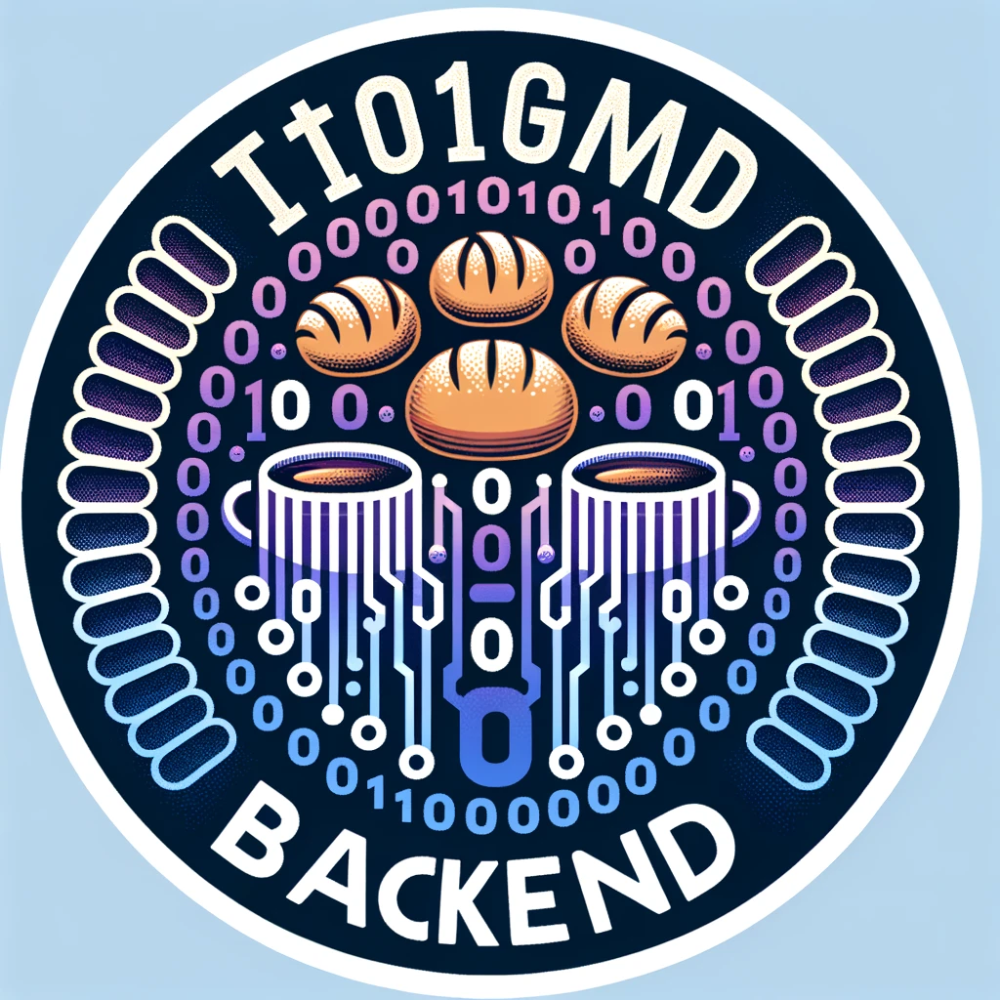

# TocGame BackEnd

El TocGame BackEnd és un sistema de gestió de terminal de punt de venda dissenyat específicament per a forns de pa i cafeteries. Aquest projecte utilitza el framework NestJS juntament amb Fastify per oferir una solució eficient i escalable per al maneig de les operacions diàries d'un negoci.

## Característiques

- **Gestió de Vendes:** Processament i seguiment de les vendes en temps real.
- **Gestió de Productes:** Administració del catàleg de productes, incloent preus, descripcions i disponibilitat.
- **Autenticació i Seguretat:** Implementació de mecanismes d'autenticació per assegurar l'accés al sistema.
- **Integració amb Impressores de Tiquets:** Suport per a l'enviament de comandes a impressores de tiquets per a la generació automàtica de rebuts.
- **Comunicació MQTT:** Utilització del protocol MQTT per a la comunicació en temps real amb diferents dispositius i serveis.
- **Parametrització Flexible:** Configuració fàcil dels paràmetres de l'aplicació per adaptar-se a les necessitats específiques de cada negoci.

## Tecnologies Utilitzades

- **NestJS:** Framework de backend per a aplicacions Node.js.
- **Fastify:** Adaptador HTTP lleuger i de ràpid rendiment per a NestJS.
- **Axios:** Client HTTP basat en promeses per a la realització de peticions HTTP.
- **MQTT:** Protocol de missatgeria lleuger per a la comunicació entre dispositius.
- **TypeScript:** Llenguatge de programació tipat superset de JavaScript.

## Començar

Per a iniciar el projecte TocGame BackEnd, seguiu els passos següents:

1. **Instal·lació de Dependències:**

   Assegureu-vos que teniu Node.js i npm instal·lats. Després, executeu el següent comandament per a instal·lar les dependències del projecte:

   ```bash
   npm install
   ```

2. **Configuració de l'Entorn:**

   Configureu les variables d'entorn necessàries (per exemple, l'adreça de la base de dades, credencials d'autenticació, etc.) segons les necessitats del vostre entorn.

3. **Inici de l'Aplicació:**

   Per a iniciar l'aplicació en mode desenvolupament, executeu:

   ```bash
   npm run start:dev
   ```

   Per a producció, primer construïu l'aplicació:

   ```bash
   npm run build
   ```

   I després inicieu-la amb:

   ```bash
   npm run start
   ```

## Contribuir

Aquest projecte és obert a contribucions. Si esteu interessats a millorar el TocGame BackEnd, no dubteu a fer fork del repositori, realitzar els vostres canvis i enviar una sol·licitud de pull.

## Llicència

El TocGame BackEnd està llicenciat sota una Llicència d'Ús i Codi Privat de Venda. Això significa que l'ús, distribució i modificació del codi són permesos exclusivament sota els termes i condicions especificats en aquesta llicència, que inclou restriccions en la redistribució del codi font i l'ús comercial sense l'autorització explícita dels titulars de la llicència.
